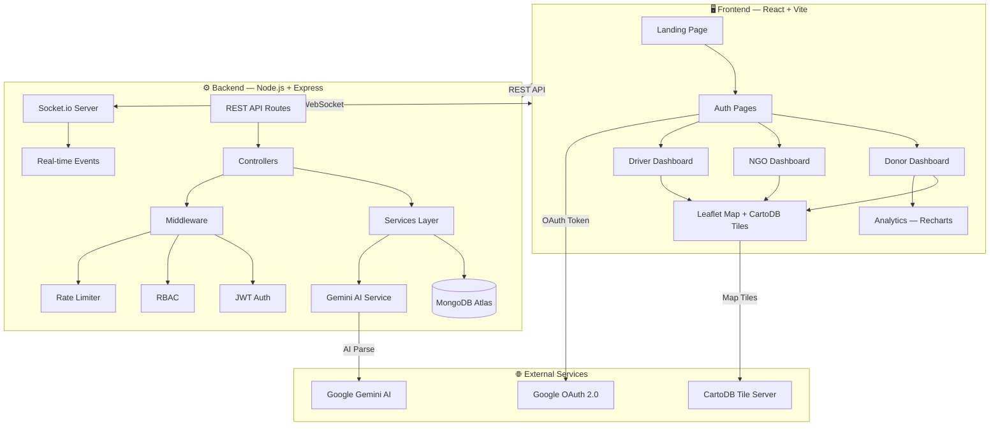
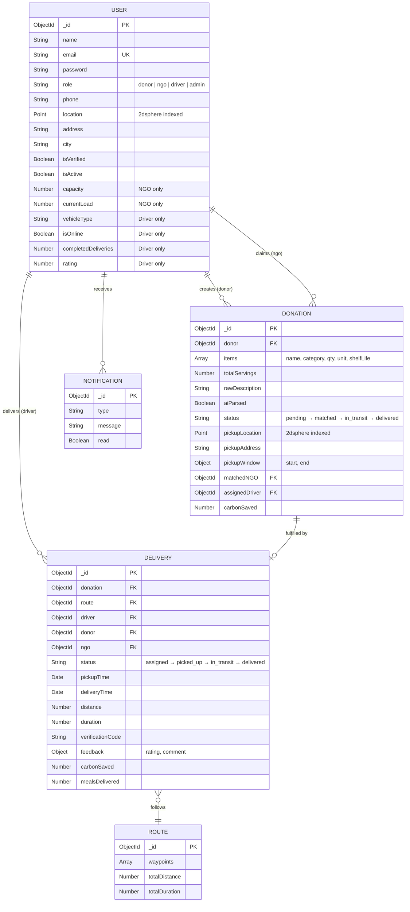
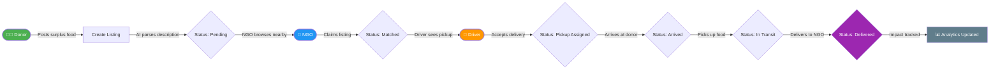
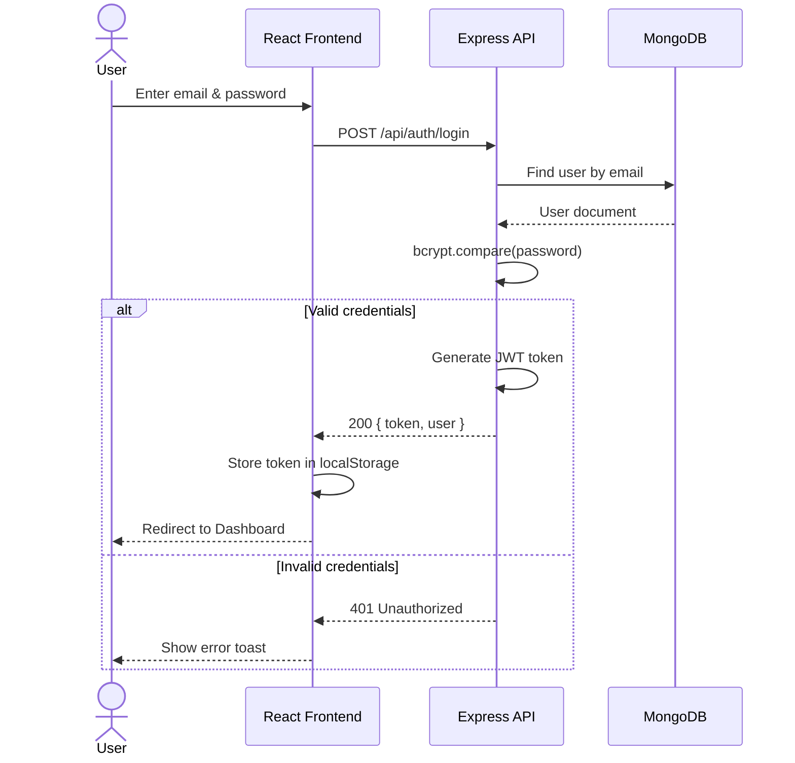
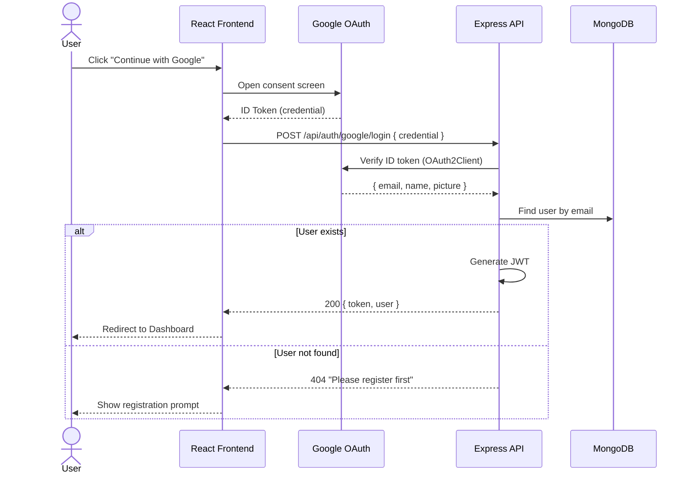
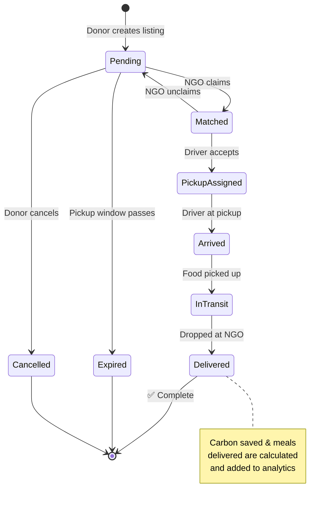
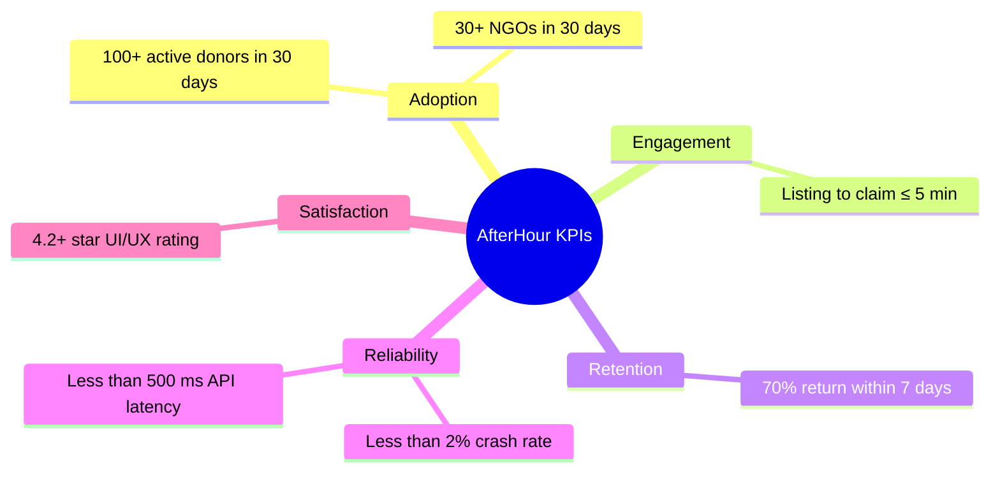

<p align="center">
  
</p>

<h1 align="center">AfterHour</h1>
<h3 align="center">AI‑Powered Urban Food Rescue & Logistics Platform</h3>

<p align="center">
  <em>Redistributing surplus food from restaurants and hotels to NGOs and shelters through real‑time dispatch and intelligent routing.</em>
</p>

<p align="center">
  
  
  
  
  
  
  
  
</p>

<p align="center">
  
  
  
</p>

---

## 📋 Table of Contents

- [Problem Statement](#-problem-statement)
- [Features](#-features)
- [System Architecture](#-system-architecture)
- [Tech Stack](#-tech-stack)
- [Project Structure](#-project-structure)
- [Database Schema](#-database-schema)
- [API Endpoints](#-api-endpoints)
- [User Flows](#-user-flows)
- [Authentication Flow](#-authentication-flow)
- [Delivery Lifecycle](#-delivery-lifecycle)
- [User Roles](#-user-roles)
- [Getting Started](#-getting-started)
- [Environment Variables](#-environment-variables)
- [Non‑Functional Requirements](#-non-functional-requirements)
- [Success Metrics](#-success-metrics)
- [Risks & Mitigations](#-risks--mitigations)
- [License](#-license)

---

## 🔴 Problem Statement

| Problem | Impact |
|---------|--------|
| Restaurants & institutions discard large amounts of surplus food daily. | ~68 million tonnes of food wasted in India annually. |
| NGOs lack a real‑time view of available food and rely on manual coordination. | Delayed response, missed donations. |
| Volunteer drivers have no optimized routes. | Higher travel time, increased carbon footprint. |

**AfterHour** solves this by creating a live digital bridge between surplus food and the people who need it most.

---

## ✨ Features

| # | Feature | Description |
|---|---------|-------------|
| 1 | 🔐 **Dual Authentication** | Email/password + Google OAuth with JWT sessions. |
| 2 | 👥 **Role‑Based Dashboards** | Tailored views for Donor, NGO, Driver, and Admin. |
| 3 | 🗺️ **Live Map (Leaflet + CartoDB)** | Real‑time markers for all participants with dark/light tile switching. |
| 4 | 📦 **Food Listing CRUD** | Donors create listings; NGOs claim; drivers accept for delivery. |
| 5 | 🤖 **AI‑Powered Parsing** | Google Gemini AI parses natural‑language food descriptions into structured data. |
| 6 | 🚗 **Delivery Routing** | Polyline route from pickup → drop‑off visible to all parties. |
| 7 | ⚡ **Real‑time Updates** | Socket.io pushes listing status, driver location, and notifications instantly. |
| 8 | 📊 **Analytics Dashboard** | Impact metrics (meals saved, CO₂ reduced) with Recharts visualizations. |
| 9 | 🌙 **Dark Mode** | Full theme toggle with CSS custom properties. |
| 10 | 🛡️ **Security** | Helmet, CORS, rate limiting, bcrypt hashing, input validation. |

---

## 🏗️ System Architecture



---

## 🛠️ Tech Stack

### Frontend

| Technology | Purpose |
|-----------|---------|
|  | UI library |
|  | Build tool & dev server |
|  | Styling with CSS custom properties |
|  | Animations & transitions |
|  | Interactive maps |
|  | Map tile provider (dark + light basemaps) |
|  | Data visualization charts |
|  | Client‑side routing |
|  | HTTP client |
|  | Real‑time client |
|  | Google Sign‑In |
|  | Icon library |
|  | Toast notifications |

### Backend

| Technology | Purpose |
|-----------|---------|
|  | JavaScript runtime |
|  | Web framework |
|  | NoSQL database |
|  | ODM for MongoDB |
|  | Real‑time engine |
|  | Token‑based auth |
|  | Password hashing (12 salt rounds) |
|  | HTTP security headers |
|  | Server‑side OAuth verification |
|  | AI food description parsing |
|  | HTTP request logging |
|  | Input validation |
|  | API rate limiting |

---

## 📁 Project Structure

```
AfterHourr/
├── backend/
│   ├── config/
│   │   ├── db.js                 # MongoDB connection
│   │   ├── env.js                # Environment config
│   │   └── socket.js             # Socket.io initialization
│   ├── controllers/
│   │   ├── authController.js     # Login, register, Google OAuth
│   │   ├── donationController.js # Listing CRUD & claim flow
│   │   ├── ngoController.js      # NGO‑specific operations
│   │   ├── driverController.js   # Driver dispatch & delivery
│   │   ├── aiController.js       # Gemini AI integration
│   │   └── analyticsController.js# Impact metrics
│   ├── middleware/
│   │   ├── auth.js               # JWT verification
│   │   ├── rbac.js               # Role‑based access control
│   │   ├── rateLimiter.js        # API rate limiting
│   │   └── errorHandler.js       # Global error handler
│   ├── models/
│   │   ├── User.js               # User schema (all roles)
│   │   ├── Donation.js           # Food listing schema
│   │   ├── Delivery.js           # Delivery tracking schema
│   │   ├── Notification.js       # Push notification schema
│   │   └── Route.js              # Route/path schema
│   ├── routes/                   # Express route definitions
│   ├── services/
│   │   ├── geminiService.js      # Google Gemini AI integration
│   │   ├── matchingService.js    # NGO ↔ Donation matching
│   │   ├── dispatchService.js    # Driver dispatch logic
│   │   ├── routingService.js     # Route calculation
│   │   └── notificationService.js# Real‑time notifications
│   ├── utils/
│   │   ├── haversine.js          # Distance calculation
│   │   ├── generateToken.js      # JWT token generation
│   │   └── validators.js         # Input validation rules
│   ├── seed/                     # Database seeding scripts
│   └── server.js                 # Express + Socket.io entry point
│
├── frontend/
│   └── src/
│       ├── animations/           # Framer Motion variants
│       ├── components/
│       │   ├── common/           # Shared UI components
│       │   │   ├── GeospatialMap.jsx    # Leaflet + CartoDB map
│       │   │   ├── Sidebar.jsx          # Navigation sidebar
│       │   │   ├── TopHUD.jsx           # Top bar with notifications
│       │   │   ├── GlassCard.jsx        # Glassmorphism card
│       │   │   ├── MetricCard.jsx       # Stat card
│       │   │   ├── StatusBadge.jsx      # Status indicator
│       │   │   ├── FloatingDock.jsx     # Floating action bar
│       │   │   ├── AddressAutocomplete.jsx  # Location picker
│       │   │   └── LoadingState.jsx     # Loading skeleton
│       ├── context/
│       │   ├── AuthContext.jsx   # Auth state + Google OAuth
│       │   ├── SocketContext.jsx # Socket.io connection
│       │   └── ThemeContext.jsx  # Dark/light mode toggle
│       ├── layouts/
│       │   ├── AuthLayout.jsx    # Login/Register wrapper
│       │   └── DashboardLayout.jsx # Dashboard wrapper
│       ├── pages/
│       │   ├── Landing.jsx       # Public landing page
│       │   ├── Login.jsx         # Login (email + Google)
│       │   ├── Register.jsx      # Register (email + Google)
│       │   ├── DonorDashboard.jsx
│       │   ├── NGODashboard.jsx
│       │   ├── DriverDashboard.jsx
│       │   ├── Listings.jsx      # All food listings
│       │   ├── Deliveries.jsx    # Active deliveries
│       │   ├── LiveMap.jsx       # Full‑screen live map
│       │   ├── Analytics.jsx     # Impact dashboard
│       │   ├── Settings.jsx      # User settings
│       │   └── Network.jsx       # User network
│       └── services/
│           └── api.js            # Axios API layer
```

---

## 🗄️ Database Schema



---

## 🔌 API Endpoints

### Authentication

| Method | Endpoint | Description |
|--------|----------|-------------|
|  | `/api/auth/register` | Register with email/password |
|  | `/api/auth/login` | Login with email/password |
|  | `/api/auth/google/login` | Login with Google OAuth |
|  | `/api/auth/google/register` | Register with Google OAuth |
|  | `/api/auth/me` | Get current user profile |

### Donations

| Method | Endpoint | Description |
|--------|----------|-------------|
|  | `/api/donations` | Create food listing |
|  | `/api/donations` | Get all listings |
|  | `/api/donations/my` | Get donor's own listings |
|  | `/api/donations/:id` | Update listing |
|  | `/api/donations/:id` | Delete listing |

### NGO

| Method | Endpoint | Description |
|--------|----------|-------------|
|  | `/api/ngo/available` | Get nearby available donations |
|  | `/api/ngo/claim/:id` | Claim a donation |
|  | `/api/ngo/claims` | Get NGO's claimed donations |

### Driver

| Method | Endpoint | Description |
|--------|----------|-------------|
|  | `/api/driver/available` | Get available pickups |
|  | `/api/driver/accept/:id` | Accept a delivery |
|  | `/api/driver/status/:id` | Update delivery status |
|  | `/api/driver/location` | Update driver location |
|  | `/api/driver/deliveries` | Get delivery history |

### AI & Analytics

| Method | Endpoint | Description |
|--------|----------|-------------|
|  | `/api/ai/parse` | AI‑parse food description |
|  | `/api/analytics/dashboard` | Get impact metrics |
|  | `/api/health` | Health check |

---

## 🔄 User Flows

### Donation Lifecycle — End‑to‑End Flow



---

## 🔐 Authentication Flow

### Email + Password Login



### Google OAuth Login



---

## 📦 Delivery Lifecycle



---

## 👥 User Roles

| Role | Dashboard | Key Capabilities |
|------|-----------|-----------------|
|  | Control Center | AI food logging, listing management, impact metrics, live tracking |
|  | Resource Hub | Nearby donations feed, one‑click claim, capacity management |
|  | Dispatch | Route timeline, pickup verification, delivery history |
|  | Admin Panel | User management, listing oversight, system analytics |

---

## 🚀 Getting Started

### Prerequisites

| Requirement | Version |
|------------|---------|
| Node.js | 18+ |
| npm | 9+ |
| MongoDB Atlas | Free tier works |
| Google Cloud Console | OAuth Client ID |

### 1. Clone & Install

```bash
git clone https://github.com/your-username/AfterHourr.git
cd AfterHourr

# Backend
cd backend && npm install

# Frontend
cd ../frontend && npm install
```

### 2. Configure Environment

See [Environment Variables](#-environment-variables) below.

### 3. Seed Database

```bash
cd backend
npm run seed
```

**Demo accounts** (password: `password123`):

| Role | Email |
|------|-------|
| 🧑‍🍳 Donor | `taj@demo.com` |
| 🏢 NGO | `roti@demo.com` |
| 🚗 Driver | `vikram@demo.com` |

### 4. Run

```bash
# Terminal 1 — Backend
cd backend && npm run dev

# Terminal 2 — Frontend
cd frontend && npm run dev
```

Open **http://localhost:5174** in your browser.

---

## 🔑 Environment Variables

### Backend (`backend/.env`)

| Variable | Description | Required |
|----------|-------------|----------|
| `MONGODB_URI` | MongoDB Atlas connection string | ✅ |
| `JWT_SECRET` | Secret for signing JWT tokens | ✅ |
| `JWT_EXPIRE` | Token expiry (e.g., `7d`) | ✅ |
| `PORT` | Server port (default `5001`) | ✅ |
| `CLIENT_URL` | Frontend URL (e.g., `http://localhost:5174`) | ✅ |
| `NODE_ENV` | `development` or `production` | ✅ |
| `GOOGLE_CLIENT_ID` | Google OAuth Client ID | ✅ |
| `GOOGLE_CLIENT_SECRET` | Google OAuth Client Secret | ✅ |
| `GROQ_API_KEY` | Groq API key (optional) | ❌ |
| `OPENAI_API_KEY` | OpenAI API key (optional) | ❌ |

### Frontend (`frontend/.env`)

| Variable | Description | Required |
|----------|-------------|----------|
| `VITE_API_URL` | Backend API URL (e.g., `http://localhost:5001/api`) | ✅ |
| `VITE_GOOGLE_CLIENT_ID` | Google OAuth Client ID | ✅ |
| `VITE_MAPBOX_TOKEN` | Mapbox token (optional) | ❌ |

---

## 📐 Non‑Functional Requirements

| Category | Requirement |
|----------|-------------|
|  | API latency ≤ 300 ms; map updates ≤ 1 s |
|  | HTTPS, JWT, bcrypt (12 salt rounds), Helmet, input validation, rate limiting |
|  | Mobile‑first responsive design, dark mode toggle, WCAG AA contrast |
|  | 99% uptime target, graceful error handling |
|  | Stateless backend, horizontally scalable, 2dsphere geo‑indexing |

---

## 📊 Success Metrics



---

## ⚠️ Risks & Mitigations

| Risk | Impact | Mitigation |
|------|--------|------------|
| 🔴 Google OAuth misconfiguration | Users blocked from signing in | Verify client ID & redirect URIs; restart servers after `.env` changes |
| 🟡 Real‑time map lag | Poor UX, stale driver locations | Socket.io heartbeat ≤ 5 s; fallback polling mechanism |
| 🟡 Data privacy (user locations) | Legal compliance issues | Store only necessary data; anonymize where possible; consent modal |
| 🟠 Scaling beyond MVP | Performance degradation | Containerize services; plan horizontal scaling early |

---

## 📄 License

This project is licensed under the **MIT License**.

---

<p align="center">
  <strong>Built with ❤️ to fight food waste</strong>
</p>

<p align="center">
  
  
  
</p>
